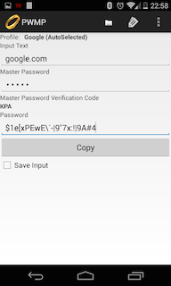
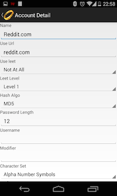

Android PasswordMaker
---

Download from the [Android Play Store](https://play.google.com/store/apps/details?id=org.passwordmaker.android)

Issues, questions, comments, or concerns, [file an issue](https://github.com/passwordmaker/android-passwordmaker/issues).

This is an implementation of the [Passwordmaker Pro](http://passwordmaker.org) algorithm.  

How it works: Basically you remember 1 password, and it will generate unique passwords for each and every website you have credentials for.  The system will always generate the same password for each site, given the same inputs (master password).  Since it uses hash algorithms to generate the new passwords, you can not get back to your master password from any generated password.  The neat thing about this system is, that no password is ever stored anywhere.  You don't have to trust a site like, lastpass or passwordsafe to keep your passwords safe from prying eyes, because it wasn't ever stored.  Then if one website gets comprised, you don't have to go around changing passwords for every website either.  Just that one website.

View the [source](https://github.com/passwordmaker/android-passwordmaker) 

## Screenshots

 

